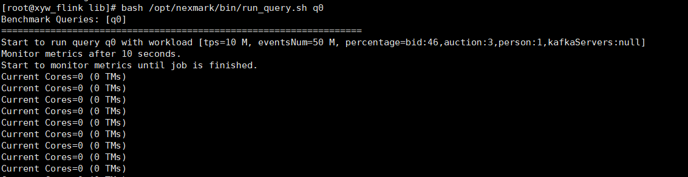

## 安装基础依赖
```
yum install -y wget unzip libXtst libXrender
```

## 【仅跑sql可跳过】安装UDF工具的RPM包
```
cd /opt
wget --no-check-certificate https://eur.openeuler.openatom.cn/results/cutie-deng/UNT/openeuler-22.03_LTS_SP4-aarch64/00110412-UNT/UNT-1.0-35.noarch.rpm
rpm -ivh UNT-1.0-35.noarch.rpm
```

## 【仅跑sql可跳过】安装UDF的基础依赖
```
mkdir -p /opt/udf-trans-opt/libbasictypes/include
mkdir -p /opt/udf-trans-opt/libbasictypes/lib

# 从OmniStream的代码仓复制（或官网的包）
cp -rf /opt/buildtools/OmniStream/cpp/conf /opt/udf-trans-opt/libbasictypes/

# 从OmniStream编译之后得到的头文件中复制
cp -rf /usr/local/OmniStream /opt/udf-trans-opt/libbasictypes/include/

# 从xxHash代码仓复制
cp -f /opt/buildtools/xxHash/xxhash.h /opt/udf-trans-opt/libbasictypes/include/

# 从Operator代码仓复制
cp -rf /opt/buildtools/OmniOperatorJIT /opt/udf-trans-opt/libbasictypes/include/

# UDF翻译的时候可能会报错缺少config.h头文件，生成一份空的config.h即可
touch /opt/udf-trans-opt/libbasictypes/include/OmniOperatorJIT/core/config.h

# 修改UDF配置
sed -i 's/udf_package=/udf_package=org.example/' /opt/udf-trans-opt/udf-translator/conf/udf_tune.properties
sed -i 's/main_class=/main_class=org.example.HuaweiMT6000c/' /opt/udf-trans-opt/udf-translator/conf/udf_tune.properties

# 从nlomann Json代码仓复制
cp -rf /opt/buildtools/json/include/nlohmann /opt/udf-trans-opt/libbasictypes/include/

# 从libboundscheck代码仓复制
cp -f /opt/buildtools/libboundscheck/include/* /opt/udf-trans-opt/libbasictypes/include/
cp -rf /opt/buildtools/libboundscheck /opt/udf-trans-opt/libbasictypes/include/

# 需要安装ksl，并配置环境变量
export CPLUS_INCLUDE_PATH=/usr/local/ksl/include:$CPLUS_INCLUDE_PATH

# kacc_gson_shell和kacc_json从官网包获取，或者直接从kacc的代码仓中获取

# jemolloc需要编译之后，从include目录复制
cp -rf /opt/buildtools/jemalloc/include/jemalloc /opt/udf-trans-opt/libbasictypes/include/
```

## 【仅跑sql可跳过】手动测试UDF是否部署成功：
```
bash /opt/udf-trans-opt/udf-translator/bin/udf_translate.sh {用例jar包路径} flink
```

## 安装Flink
```
cd /opt
wget --no-check-certificate https://repo.huaweicloud.com:8443/artifactory/apache-local/flink/flink-1.16.3/flink-1.16.3-bin-scala_2.12.tgz
tar -zxvf /opt/flink-1.16.3-bin-scala_2.12.tgz
chown -R root:root /opt/flink-1.16.3
ln -s /opt/flink-1.16.3 /opt/flink
sed -i 's/rest.bind-address: localhost/rest.bind-address: 0.0.0.0/' /opt/flink/conf/flink-conf.yaml
echo 'export FLINK_HOME=/opt/flink' >> /etc/profile
echo 'export PATH=$FLINK_HOME/bin:$PATH' >> /etc/profile
source /etc/profile
```


## 【编译环境和执行环境归一可跳过】安装OmniStream依赖
- libtnel.so: /opt/buildtools/OmniStream/cpp/build/jni/libtnel.so
- libboostkit-omniop-codegen-2.0.0-aarch64.so: /opt/buildtools/omni_home/omni-operator/lib/libboostkit-omniop-codegen-2.2.0-aarch64.so
- libboostkit-omniop-operator-2.0.0-aarch64.so: /opt/buildtools/omni_home/omni-operator/lib/libboostkit-omniop-operator-2.2.0-aarch64.so
- libboostkit-omniop-vector-2.0.0-aarch64.so: /opt/buildtools/omni_home/omni-operator/lib/libboostkit-omniop-vector-2.2.0-aarch64.so
- libboundscheck.so: /opt/buildtools/libboundscheck/lib/libboundscheck.so
- libLLVM-15.so: /usr/local/lib/libLLVM-15.so
- libxxhash.so.0: /usr/local/lib64/libxxhash.so.0
- librdkafka.so.1: /usr/local/lib/librdkafka.so.1
- librdkafka++.so.1: /usr/local/lib/librdkafka++.so.1
- librocksdb.so.8: /usr/lib64/librocksdb.so.8
- libjemalloc.so.2: /usr/local/lib/libjemalloc.so.2
- libsnappy.so.1: /usr/local/lib64/libsnappy.so.1
- libre2.so.11：/usr/local/lib64/libre2.so.11
- flink-tnel-0.1-SNAPSHOT.jar: /opt/buildtools/OmniAdaptor/omnistream/omniop-flink-extension/java/target/flink-tnel-0.1-SNAPSHOT.jar

将上述文件安装到/home/Dependency_library中，并添加到环境变量中

```
cp /opt/buildtools/OmniStream/cpp/build/jni/libtnel.so /home/Dependency_library
cp /opt/buildtools/omni_home/omni-operator/lib/libboostkit-omniop-codegen-2.2.0-aarch64.so /home/Dependency_library
cp /opt/buildtools/omni_home/omni-operator/lib/libboostkit-omniop-operator-2.2.0-aarch64.so /home/Dependency_library
cp /opt/buildtools/omni_home/omni-operator/lib/libboostkit-omniop-vector-2.2.0-aarch64.so /home/Dependency_library
cp /opt/buildtools/libboundscheck/lib/libboundscheck.so /home/Dependency_library
cp /usr/local/lib/libLLVM-15.so /home/Dependency_library
cp /usr/local/lib64/libxxhash.so.0 /home/Dependency_library
cp /usr/local/lib/librdkafka.so.1 /home/Dependency_library
cp /usr/local/lib/librdkafka++.so.1 /home/Dependency_library
cp /usr/lib64/librocksdb.so.8 /home/Dependency_library
cp /usr/local/lib/libjemalloc.so.2 /home/Dependency_library
cp /usr/local/lib64/libsnappy.so.1 /home/Dependency_library
cp /usr/local/lib64/libre2.so.11 /home/Dependency_library
cp /opt/buildtools/OmniAdaptor/omnistream/omniop-flink-extension/java/target/flink-tnel-0.1-SNAPSHOT.jar /home/Dependency_library
```

```
echo 'export LIBRARY_PATH=/home/Dependency_library:$LIBRARY_PATH' >> /etc/profile
echo 'export LD_LIBRARY_PATH=/home/Dependency_library:$LD_LIBRARY_PATH' >> /etc/profile
#echo '#export LD_PRELOAD=/home/Dependency_library/libjemalloc.so.2:$LD_PRELOAD' >> /etc/profile
source /etc/profile
```

## 安装java依赖
```
cd $FLINK_HOME/lib
wget --no-check-certificate https://repo.maven.apache.org/maven2/org/json/json/20240303/json-20240303.jar
wget --no-check-certificate https://repo.maven.apache.org/maven2/com/google/code/gson/gson/2.11.0/gson-2.11.0.jar
```

## 安装Nexmark
### 下载nexmark-flink.tgz到物理机“/opt”目录中并解压
```
cd /opt
wget --no-check-certificate https://github.com/nexmark/nexmark/releases/download/v0.2.0/nexmark-flink.tgz
tar xzf nexmark-flink.tgz
mv nexmark-flink nexmark
chown -R root:root nexmark
```

### 替换为最新的sql
使用nexmark master分支sql替换v0.2.0的sql
```
cd /opt
git clone -b master https://github.com/nexmark/nexmark.git nexmark_master
rm -f /opt/nexmark/queries/*
cp nexmark_master/nexmark-flink/src/main/resources/queries/* /opt/nexmark/queries/
rm -rf /opt/nexmark_master
```

### 编辑/opt/nexmark/conf/nexmark.yaml，用下面的内容替换
```
################################################################################
#  Licensed to the Apache Software Foundation (ASF) under one
#  or more contributor license agreements.  See the NOTICE file
#  distributed with this work for additional information
#  regarding copyright ownership.  The ASF licenses this file
#  to you under the Apache License, Version 2.0 (the
#  "License"); you may not use this file except in compliance
#  with the License.  You may obtain a copy of the License at
#
#      http://www.apache.org/licenses/LICENSE-2.0
#
#  Unless required by applicable law or agreed to in writing, software
#  distributed under the License is distributed on an "AS IS" BASIS,
#  WITHOUT WARRANTIES OR CONDITIONS OF ANY KIND, either express or implied.
#  See the License for the specific language governing permissions and
# limitations under the License.
################################################################################

#==============================================================================
# Rest & web frontend
#==============================================================================

# The metric reporter server host.
nexmark.metric.reporter.host: localhost
# The metric reporter server port.
nexmark.metric.reporter.port: 9098

#==============================================================================
# Benchmark workload configuration (events.num)
#==============================================================================

nexmark.workload.suite.100m.events.num: 50000000
nexmark.workload.suite.100m.tps: 10000000
nexmark.workload.suite.100m.queries: "q0,q1,q2,q3,q4,q5,q7,q8,q9,q10,q11,q12,q13,q14,q15,q16,q17,q18,q19,q20,q21,q22"
nexmark.workload.suite.100m.queries.cep: "q0,q1,q2,q3"
nexmark.workload.suite.100m.warmup.duration: 120s
nexmark.workload.suite.100m.warmup.events.num: 50000000
nexmark.workload.suite.100m.warmup.tps: 10000000

#==============================================================================
# Benchmark workload configuration (tps, legacy mode)
# Without events.num and with monitor.duration
# NOTE: The numerical value of TPS is unstable
#==============================================================================

# When to monitor the metrics, default 3min after job is started
# nexmark.metric.monitor.delay: 3min
# How long to monitor the metrics, default 3min, i.e. monitor from 3min to 6min after job is started
# nexmark.metric.monitor.duration: 3min

# nexmark.workload.suite.10m.tps: 10000000
# nexmark.workload.suite.10m.queries: "q0,q1,q2,q3,q4,q5,q7,q8,q9,q10,q11,q12,q13,q14,q15,q16,q17,q18,q19,q20,q21,q22"

# 指定使用内置数据生成器，而不是 Kafka
nexmark.source.type: generator

#==============================================================================
# Workload for data generation
#==============================================================================

nexmark.workload.suite.datagen.tps: 1000000
nexmark.workload.suite.datagen.queries: "insert_kafka"
nexmark.workload.suite.datagen.queries.cep: "insert_kafka"

#==============================================================================
# Flink REST
#==============================================================================

flink.rest.address: localhost
flink.rest.port: 8081

#==============================================================================
# Kafka config
#==============================================================================

# kafka.bootstrap.servers: ***:9092
```

### 安装依赖到flink
```
cp /opt/nexmark/lib/nexmark-flink-0.2-SNAPSHOT.jar /opt/flink/lib/
```

### 验证nexmark（flink原生）
```
stop-cluster.sh
ps -ef | grep flink # 检查是否有flink残余进程，如果有则杀掉，原因：验证nexmark需要一个干净的flink集群
start-cluster.sh
bash /opt/nexmark/bin/run_query.sh q0
```
显示如下则正常




## 使能OmniStream（TM和JM所在节点都执行）
修改config.sh脚本，修改$FLINK_HOME/bin目录下的config.sh，修改该文件中的constructFlinkClassPath函数，注释最后一行的echo "FLINK_CLASSPATH""FLINK_DIST"，在注释行下补充两行
```
PATCH="/home/Dependency_library/flink-tnel-0.1-SNAPSHOT.jar"
echo "$PATCH":"$FLINK_CLASSPATH""$FLINK_DIST"
```
或直接执行下列命令
```
sed -i '/^    echo "$FLINK_CLASSPATH""$FLINK_DIST"/ {
	s|echo "$FLINK_CLASSPATH""$FLINK_DIST"|# echo "$FLINK_CLASSPATH""$FLINK_DIST"|
	a\    PATCH=/home/Dependency_library/flink-tnel-0.1-SNAPSHOT.jar
	a\    echo "$PATCH":"$FLINK_CLASSPATH""$FLINK_DIST"
}' $FLINK_HOME/bin/config.sh
```

## 启动flink集群
```
start-cluster.sh
```
查看进程StandaloneSessionClusterEntrypoint和TaskManagerRunner存在，则集群启动成功

## 停止flink集群
```
stop-cluster.sh
```

## 验证OmniStream是否成功使能

```
source /etc/profile
stop-cluster.sh
ps -ef | grep flink # 检查是否有flink残余进程，如果有则杀掉，原因：验证nexmark需要一个干净的flink集群
start-cluster.sh
bash /opt/nexmark/bin/run_query.sh q0
```

```
tail -f /opt/flink/log/flink-root-taskexecutor-0*.out
```
如果有打印"welcome to native"则标准成功使能

通过设置以下环境变量，可使native结果生成到/tmp/flink_output.txt文件
```
export FLINK_PERFORMANCE="false"
export WRITE_TO_FILE="TRUE"
```